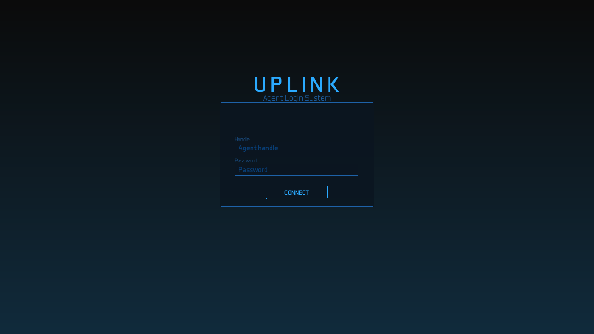
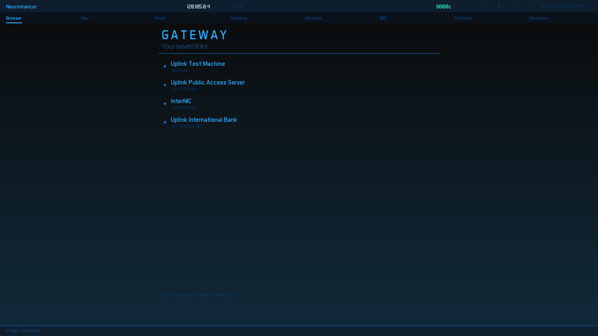
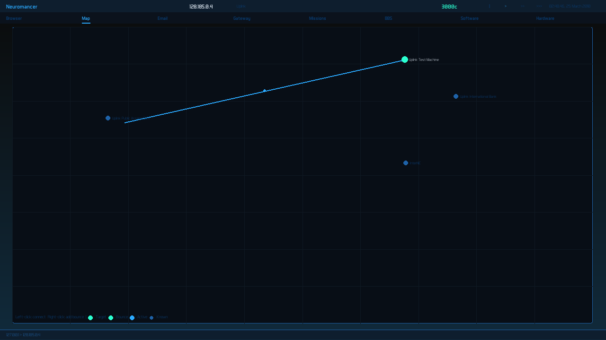
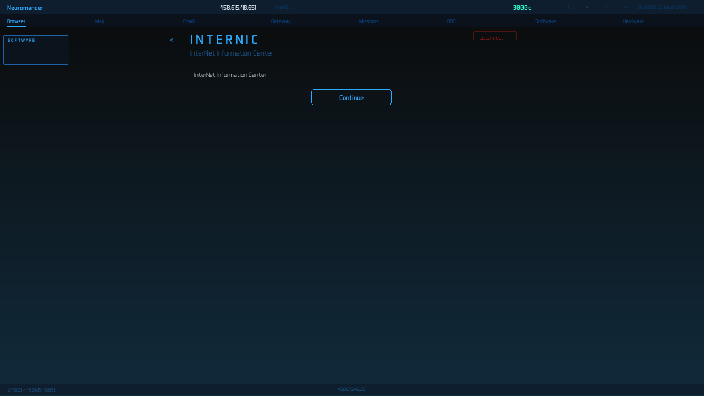
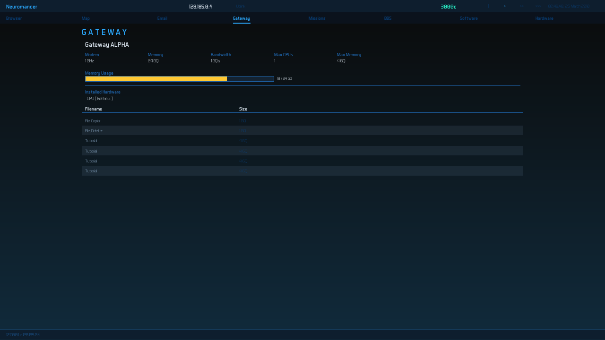
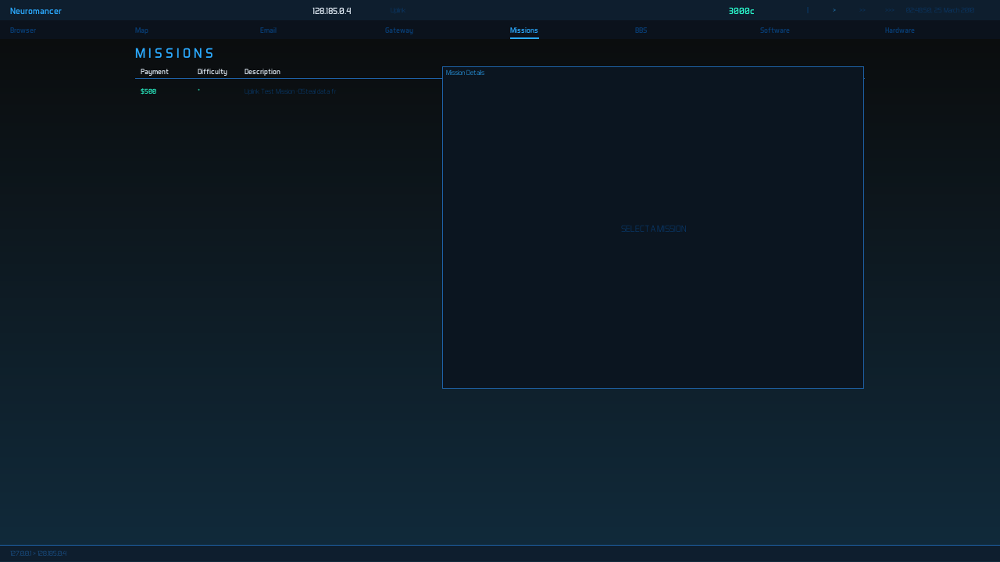
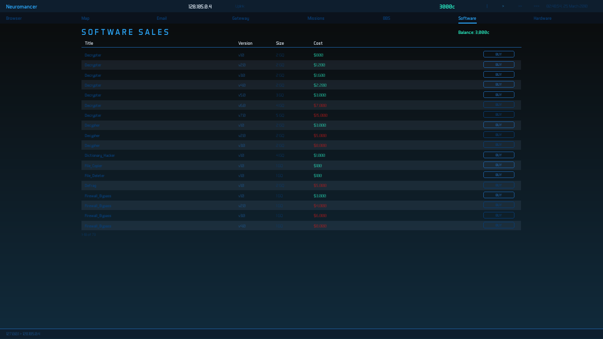
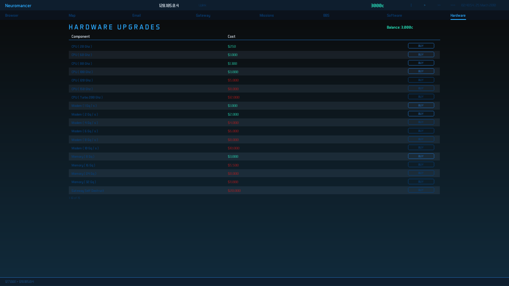

# Uplink RE — Headless Multiplayer Server + Pygame Client

A reverse-engineered headless multiplayer server and modern Python/Pygame client for [Uplink: Trust is a Weakness](https://www.introversion.co.uk/uplink/) (2001) by Introversion Software.

The server runs the original game logic without any GUI, exposing a TCP/JSON API with 40 commands. The Pygame client connects to it and provides a full cyberpunk hacker interface inspired by [UplinkOS](https://www.moddb.com/mods/uplink-os).

## Screenshots


*Agent login screen*


*Browser tab — saved server bookmarks*


*World map — server nodes with bounce routing*


*Connected to InterNIC with app sidebar*


*Gateway tab — hardware stats, memory bar, file table*


*Missions tab — active mission list with detail panel*


*Software sales — buy tools with affordability coloring*


*Hardware upgrades — CPUs, modems, memory*

## Features

### Headless Server
- Runs original Uplink game engine without OpenGL/GLUT
- TCP line-delimited JSON protocol (40 commands)
- Multiplayer via sequential context switching per session
- Session persistence (save on disconnect, restore on rejoin)

### Pygame Client
- **8 tabs**: Browser, Map, Email, Gateway, Missions, BBS, Software, Hardware
- **All server screen types**: Menu, Dialog, Password, UserID, HighSecurity, Message, Links, Log, Generic (FileServer, Records, Security, Console, CompanyInfo)
- **LAN view**: Interactive node graph with typed shapes, security indicators, and navigation
- **Password cracking**: Character-cycling animation with auto-fill
- **Bounce routing**: Right-click map nodes to build trace-evasion routes
- **App sidebar**: Run software tools (Log_Deleter, File_Copier, Decrypter, etc.)
- **Timed operations**: File copy/delete/log operations with progress bars
- **Mission workflow**: Accept from BBS, click links to connect, send completion emails
- **Console typing**: Interactive command prompt for server consoles
- **Trace tracking**: Real-time progress bar with audio warnings
- **Email compose**: Send messages with file attachments

### Visual Style
- Dark navy gradient with cyan/teal cyberpunk aesthetic
- Letter-spaced industrial titles across all screens
- Signature left-aligned `>` menu pointers
- 8 rounds of iterative visual refinement

## Requirements

### Server
- Linux x86_64
- GCC/G++ with C++11
- Libraries: SDL 1.2, SDL_mixer, FTGL, FreeType, libmikmod

### Client
- Python 3.11+
- pygame
- libmikmod (for .uni music playback)

## Quick Start

### Build the Server
```bash
export PATH="$PWD/bin:$PATH"
cd uplink/src && make
cp uplink.full ../../../game/uplink.bin.x86_64
```

### Get Game Data
You need a legitimate copy of Uplink. Copy the `.dat` files to `game/`:
```
game/data.dat
game/fonts.dat
game/graphics.dat
game/loading.dat
game/music.dat
game/patch.dat
game/sounds.dat
game/world.dat
```

Optionally, install [UplinkOS](https://www.moddb.com/mods/uplink-os) and copy assets to `game/uplinkHD/` for HD audio and fonts.

### Run the Server
```bash
rm -rf ~/.uplink/
export LD_LIBRARY_PATH="$PWD/contrib/FTGL-2.1.2/unix/src/.libs"
game/uplink.bin.x86_64 --headless --port 9090
```
Startup takes ~50 seconds. Wait for port 9090.

### Run the Client
```bash
cd client
python3 -m venv .venv
source .venv/bin/activate
pip install pygame
python3 uplink_client.py
```

Optional flags: `--no-music`, `--debug-log /tmp/debug.json`, `--light-theme`

### Auto-testing
```bash
python3 uplink_client.py --auto-join AgentName --auto-connect 128.185.0.4 --auto-crack
```

## API Commands (40)
```
join, state, connect, connect_bounce, disconnect, navigate, back, menu,
dialog_ok, password, crack_password, files, copy_file, delete_file, logs,
delete_logs, send_mail, check_mission, links, missions, bbs, accept_mission,
balance, gateway_files, gateway_info, hardware_list, buy_hardware, inbox,
trace, begin_trace, search, lan_scan, screen_links, software_list,
buy_software, set_field, speed, click, type, key, delete_gateway_file
```

## Legal

The Uplink source code was released by Introversion Software. This project modifies it to add headless/multiplayer functionality. Game data files (`.dat`) are **not included** and must be obtained from a legitimate copy of the game. UplinkOS assets are a separate mod and are also not included.

## License

The Uplink source code is provided under its original terms by Introversion Software. The Pygame client and headless server modifications are original work.
